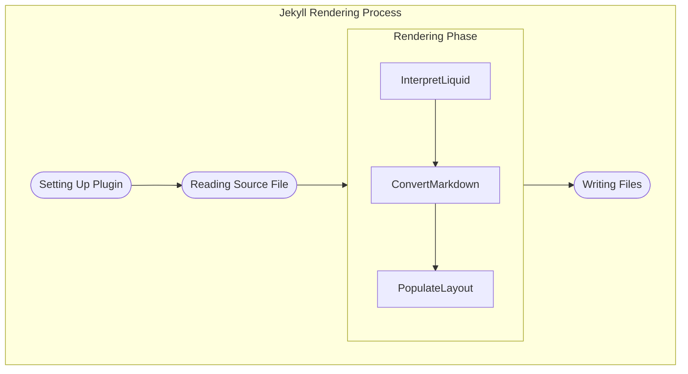

- #### Jekyll’s *rendering phase* is further divisible into three optional stages with the _output_ from a stage being the _input_ for the succeeding stage:
	- Every file rendered, passes through one or more of these stages as determined by the file’s content string, front matter and extension.
	- The three optional stages
		- **Interpreting Liquid expressions in the file**  
			- evaluates Liquid expressions in the current file
			- any Liquid expression in the file’s front matter is left untouched.
		- **Unleashing the converters**
			- invokes the converter mapped to the current file’s extension and converts the input string. This is when Markdown gets converted into HTML and Sass / Scss into CSS
			- Since this is determined by the file’s extension, Markdown inside a `.html` file will remain untouched.
		- **Populating the layouts**
			- By this stage, _the source file_ is considered rendered and it will not be revisited. 
			- However, based on the file’s extension and consequently based on the front matter, it is determined whether to take the _output_ string from the preceding stage and place into layouts or not.
- #### Jekyll processes/converts markdown page to html before applying the Layouts – so any liquid scripts in the layout need to address content as an HTML
	- liquid scripts such as to convert blockquote to callout then must search for `<blockquote>` instead of `> ` (see [[jekyll liquid for converting obsidian callout]])
	- this will be trickier to do for markdown aliases i.e. `[[filename.md|alias]]`
- #### Process to place rendered markdown into layouts is determined based on the file’s extension and consequently based on the front matter
	- It will determine whether to take the _output_ string from the preceding stage and place into layouts or not.
	- A layout template that has a layout will have nested layout placement
		- e.g. `content` → Post Layout → Default Layout

## References
- [Rendering Process | Jekyll • Simple, blog-aware, static sites (jekyllrb.com)](https://jekyllrb.com/docs/rendering-process/)

## Metadata
- topic:: [[00 Coding]]
	- related:: [[01 Jekyll]]
- created:: [[2023-01-15]]
- updated:: [[2023-01-15]]
- #PermanentNote 
